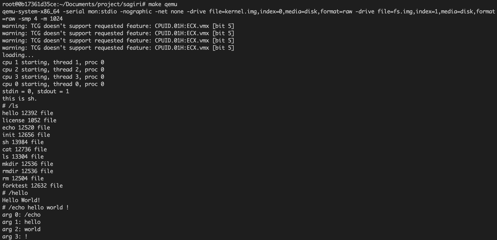

# x64 smp operating system

一个简单的操作系统, 可以在x86-64多核处理器上运行.

## 背景

这是我在操作系统实验课程中完成的作业, 由于课上只讲了在32位单核CPU上的操作系统设计, 而我对在多核处理器上运行的操作系统比较感兴趣, 因此选择了在x64对称多处理器上写一个操作系统这一作业.

## 开发环境

使用Ubuntu 16.04开发. 安装依赖:

```
apt install make gcc gdb qemu
```

运行

```
make qemu
```



## 技术要点

* 为应用程序提供进程/线程API, 支持进程/线程的创建, 等待, 取消, 睡眠等操作.

* 实现了进程创建过程中的内存copy-on-write技术.

* 通过恰当的同步互斥机制避免多个CPU执行指令时的竞争条件.

* 利用LAPIC/IOAPIC实现多核CPU的启动和中断控制.

* 通过thread_local变量存储与特定CPU相关的变量.

## 已实现的系统调用

|编号|名称|
|---|---|
|0|fork|
|1|exit|
|2|thread_create|
|3|thread_exit|
|4|wait_process|
|5|wait_thread|
|6|get_pid|
|7|get_tid|
|8|kill_process|
|9|kill_thread|
|10|sleep|
|11|open|
|12|close|
|13|read|
|14|write|
|15|unlink|
|16|readdir|
|17|stat|
|18|mkdir|
|19|rmdir|
|20|lseek|
|21|exec|

## 远期目标

* 实现信号机制.

* 实现对一个常用文件系统的支持.

* TCP/IP协议栈.